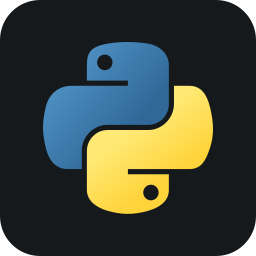
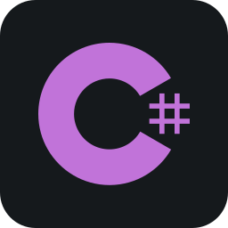
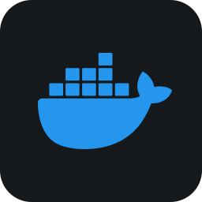
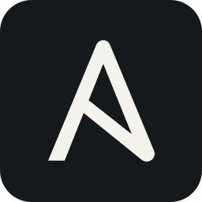

# 
👨‍💻 daniel-mizsak

    <kbd>
        
    </kbd>

## 👋 Introduction

Hi, I am Daniel.

I work as an AI Infrastructure Developer in Copenhagen. 
I enjoy programming in Python and automating everything I can.

## 🛠️ Tools

### Languages & Frameworks

    
    
    
    
    

### DevOps & IaC

    
    
    
    
    

### Cloud & OS

    
    
    
    

## 🏢 Organizations

| Organization                                                                                                                    |                 Website                  | Description                               |
| :------------------------------------------------------------------------------------------------------------------------------ | :--------------------------------------: | :---------------------------------------- |
|  | [pythonvilag.hu](https://pythonvilag.hu) | Python programming tutorials in Hungarian |
|      |      [mlops.top](https://mlops.top)      | MLOps related solutions and templates     |

